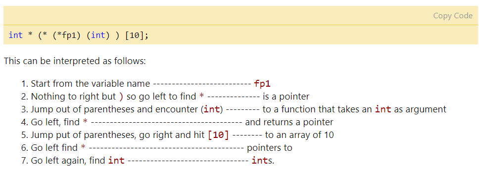

# C++ primer2/3/4 章
## 1 第二章
### 1.1 类型转换和整形提升

#### 1.1.1 隐式类型转换
数组退化为指针
~~~c
void fun_ptr(int arr[]) //传入指针,数组的头部地址按照值传递,拷贝给fun函数新创建的指针变量;
{
    sizeof(arr); //4
}
void fun_ref(int (&arr)[]) //传入引用,阻止拷贝发生,传和形参一样大小数组
{
    sizeof(arr); //40
}

template<int T>
void fun_tem(int (&arr)[T])
{
    for(auto a:arr){

    }
}

int main(){
    int a[10];
    fun_ptr(a);
    fun_ref(&a);
    fun_tem();
}

~~~
函数转换为函数指针
1) 指向可执行代码的开头
2) 不分配内存
3) 函数名可以用来获取函数地址
  

~~~c++

void fun(int a)
{
    printf("Value of a is %d\n", a);
}
  
int main()
{
    // fun_ptr is a pointer to function fun() 
    void (*fun_ptr)(int) = fun; 
    void (*fun_ptr)(int) = &fun;
    /* The above line is equivalent of following two
       void (*fun_ptr)(int);
       fun_ptr = &fun; 
    */
    // Invoking fun() using fun_ptr
    (*fun_ptr)(10);
    fun_ptr(10);  
    return 0;
}

// p是一个指针,指向函数,入参char 返回 int
int (*p)(char);
// 指向函数,入参2float 返回指针指向指针指向char
char ** (*p)(float, float);
// an array of 5 pointers to functions that receive two const pointers to chars and return a void pointer
void * (*a[5])(char * const, char * const);
~~~
bool

整形类型提升: 

在表达式计算时要在cpu器件内执行,CPU内整型运算器(ALU)的操作数的字节长度 ，一般就是int的字节长度，同时也是CPU的通用寄存器的长度。
所以表达式中小于int先转换为int再执行运算;
signed:按照数据类型符号位提升, 高位直接补充符号位;unsigned 高位直接补0
1) char/short转换为int,float转换为double 
2) 其中一个操作数类型为double/long/unsigned,另一个操作数也转换为double/long/unsigned
3) 否则两操作数都转为int
4) 如果int可以完整表示源类型的所有值，那么该源类型的值就转换为int，否则转换为unsigned int,long,unsigned long。

数值转换

数据指针到void指针

1) 任何类型的指针都可以直接赋值给它，无需进行强制类型转换。
2) void型指针解引用须做类型指定 GNU指定“void”的算法操作与“char”一致，因此上述写法在GNU则可以编译
3) 
~~~c
// 任何类型的指针都可以传入 memcpy 和 memset 中，这也真实地体现了内存操作函数的意义
void * memcpy(void *dest, const void *src, size_t len);
void * memset(void * buffer, int c, size_t num);
~~~ 

#### 1.1.2 const转换
底层: const wolatle转换,只能添加不能减少

#### 1.1.3 显式类型转换
const_cast : 常量引用\指针->非常量
static_cast : 基类和派生类转换
dynamic_cast : 
reinterpret_cast : 任意指针之间的转换

### 1.2 结构体对齐
补充: nested pack
~~~c++
#pragma pack (4)                // 4-byte alignment
         struct nested {
           int  x;
           char y;
           int  z;
         };

         #pragma pack(1)           // 1-byte alignment
         struct packedcxx{
            char   a;
            short  b;
            struct nested  s1;     // 4-byte alignment
         };
~~~

字节序:大端小端
运算符优先级
括号,单目运算(++ -- * */% +-),移位,关系比较,等于不等,位异或, 三分,逻辑与或,&& ||,条件高于赋值,逗号
逗号,从左往右,值为最后一个表达式
(2<=x<=3)恒等1
右移前考虑先转换成usigned

补码源码,设计原理

### 1.3 const
1) 与define区别：只给出对应内存地址，所以多次调用只有一个copy，可以进行安全检查
2) 作用域，非const变量默认为extern。要使const变量能够在其他文件中访问，必须在文件中显式地指定它为extern。
3) 指针与const:向左结合　const*ｐ 指针p指向常量　*const p　常量指针指向p
4) 允许把非const对象的地址赋给指向const对象的指针。
~~~c++
//  same type - constant integers
const int n=5;
int const m=10;

// pointers to const ints
const int *p; 
int const *q;

int * const r= &n; //A const pointer to an int
const int * const p=&n //A const pointer to a const int

// 向左结合
char ** p1; // pointer to pointer to char
const char **p2; // pointer to pointer to const char
char * const * p3; // pointer to const pointer to char
const char * const * p4; // pointer to const pointer to const char
char ** const p5; // const pointer to pointer to char
const char ** const p6; // const pointer to pointer to const char
char * const * const p7; // const pointer to const pointer to char
const char * const * const p8; // const pointer to const to const char
~~~
5) 函数

typedef
~~~c++
// both p and q become pointers
typedef char * PCHAR;
PCHAR p,q;

typedef char * a;  // a is a pointer to a char

typedef a b();     // b is a function that returns
                   // a pointer to a char

typedef b *c;      // c is a pointer to a function
                   // that returns a pointer to a char

typedef c d();     // d is a function returning
                   // a pointer to a function
                   // that returns a pointer to a char

typedef d *e;      // e is a pointer to a function 
                   // returning  a pointer to a 
                   // function that returns a 
                   // pointer to a char

e var[10];         // var is an array of 10 pointers to 
                   // functions returning pointers to 
                   // functions returning pointers to chars.
~~~

constexpr
decltype